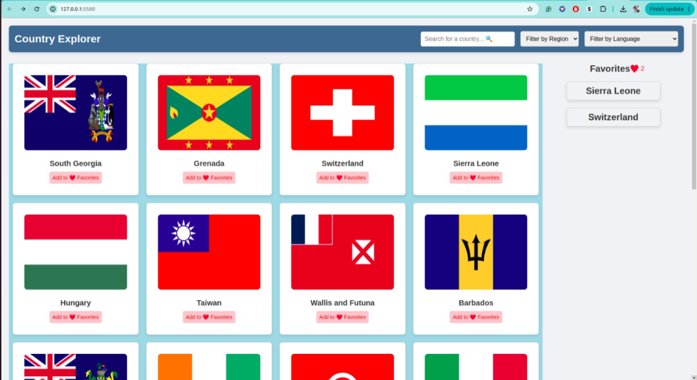

### 🌍 Welcome to **Country Explorer**!

*Screenshot of the Country Explorer app interface.*

**Country Explorer** is an interactive web application that allows users to explore countries around the world, providing key information about each country through a clean and intuitive interface. This project was built using vanilla JavaScript, HTML, and CSS, emphasizing design, performance optimization, and a seamless user experience.
**Features**

    Landing Page: A list of all countries displayed as interactive cards, each showing the country's name and flag. The list is paginated for a smooth browsing experience.
    Search: A search bar with dynamic suggestions for countries based on the user’s input. Users can also view all matching results.
    Details Page: A dedicated page for each country, displaying detailed information (Name, Top Level Domain, Capital, Region, Population, Area, Languages) with a back navigation option.
    Enhanced Filtering: Users can filter countries by Language or Region, and apply these filters along with search keywords.
    Favorites: Users can mark up to 5 countries as favorites, displayed in a vertical section on the right. Favorites persist across sessions using local storage.

**Technology Stack**

    HTML/CSS/JavaScript: Core front-end technologies, without frameworks or libraries.
    REST Countries API: Provides the country data.
    Fetch API: Handles asynchronous API requests.
    Local Storage: Used to store and retrieve favorite countries.

**Project Structure**

    index.html: Main HTML file.
    style.css: CSS file for styling and responsive design.
    script.js: JavaScript file containing core application logic.
    country.js: JavaScript file containing logic for country details page.
    country-details.html: Html file containing for county  details page.
---

### ✨ **Features You'll Love**

- **🔍 Quick Search**: Just start typing to find countries instantly.
- **🌎 Region Filter**: Pick a region and Language like Asia or Europe to see just those countries and search y Language like english and spanish.
- **⬇️ Load More**: Start with a few and load more countries as you scroll.
- **📄 Country Details**: Click "View Details" on any country to see more about its population, region, and other interesting facts.
- **🔗 View Details**: Click on a country card to navigate to the details page and see rich information.

- **⭐ Manage Favorites**: Click the favorites icon on the details page to mark countries as favorites. You can remove favorites or add new ones, with the favorites displayed on the main page.

---

### 🛠️ **Built Using**

- **HTML & CSS**: For layout and styling.
- **JavaScript**: Powers all interactive features and fetches data.
- **REST Countries API**: Brings in real-time data for each country.

---

### 🚀 **How to Explore**

1. **Search**: Start typing a country’s name in the search bar to locate it quickly.
2. **Filter by Region and Language**: Use the dropdown to narrow your list by regions like Africa, Americas, or Oceania and Use the dropdown to narrow your languages .
3. **Load More**: Click "Show More" as you scroll to reveal additional countries.
4. **View Details**: Click on a country card to navigate to the details page and see rich information.
5. **Manage Favorites**: Click the favorites icon on the details page to mark countries as favorites. You can remove favorites or     add new ones, with the favorites displayed on the main page.
6. **Storing in localStorage**: Use JSON.stringify and JSON.parse to manage the list of favorite countries.

---

Give **Country Explorer** a try and enjoy discovering the world!

[Explore Country Explorer](https://country-explorer-woad-gamma.vercel.app/)

