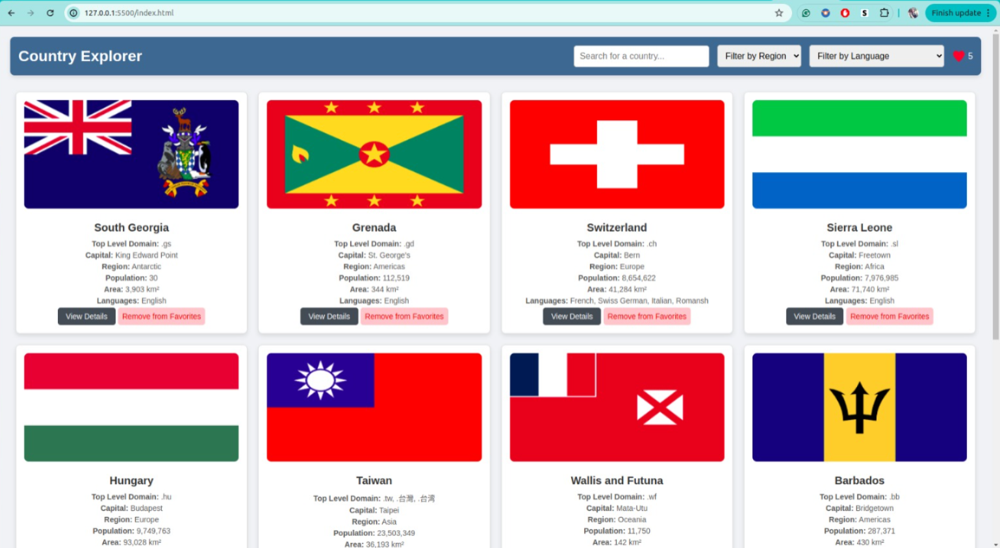

Here's the corrected version with the placeholder path updated:

---

### 🌍 Welcome to **Country Explorer**!

**Country Explorer** is a website  for discovering and learning about countries worldwide. Easily search for any country, explore them by region, and dive into detailed info on each one.

*Screenshot of the Country Explorer app interface.*

---

### ✨ **Features You'll Love**

- **🔍 Quick Search**: Just start typing to find countries instantly.
- **🌎 Region Filter**: Pick a region like Asia or Europe to see just those countries.
- **⬇️ Load More**: Start with a few and load more countries as you scroll.
- **📄 Country Details**: Click "View Details" on any country to see more about its population, region, and other interesting facts.

---

### 🛠️ **Built Using**

- **HTML & CSS**: For layout and styling.
- **JavaScript**: Powers all interactive features and fetches data.
- **REST Countries API**: Brings in real-time data for each country.

---

### 🚀 **How to Explore**

1. **Search**: Start typing a country’s name in the search bar to locate it quickly.
2. **Filter by Region**: Use the dropdown to narrow your list by regions like Africa, Americas, or Oceania.
3. **Load More**: Click "Show More" as you scroll to reveal additional countries.
4. **View Details**: Click on a country card to navigate to the details page and see rich information.
5. **Manage Favorites**: Click the favorites icon on the details page to mark countries as favorites. You can remove favorites or     add new ones, with the favorites displayed on the main page.

---

Give **Country Explorer** a try and enjoy discovering the world!

[Explore Country Explorer](https://country-explorer-woad-gamma.vercel.app/)

